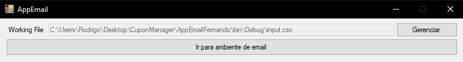
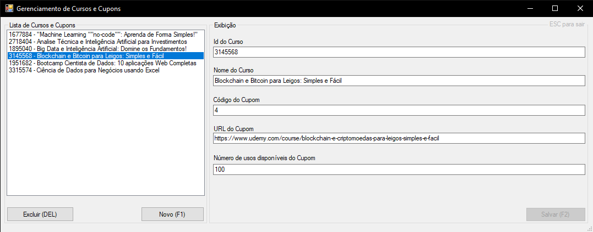
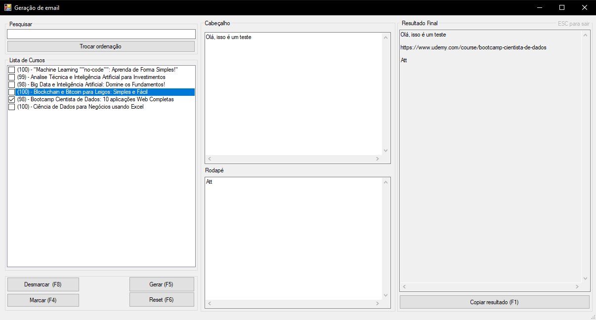

# CuponManager

A windows form application created to help manage promotion coupons of udemy by creating templated emails with promocional coupons

- It handles the number of available cupons each time a email is generated
- The crud part is to manage the courses with its coupons and save into a csv file each time its used (available uses)
- The Email part is to generate and email body for each coupon and course selected
- In this part you can put the email header and footer with coupon contents of the selected courses

## Usage

Put the [input file](AppEmailFernando/input.csv) in the folder of the generated executable

## Screens

- Show the program options

- Manage coupons

- Generate emails to distribute promotial coupons

